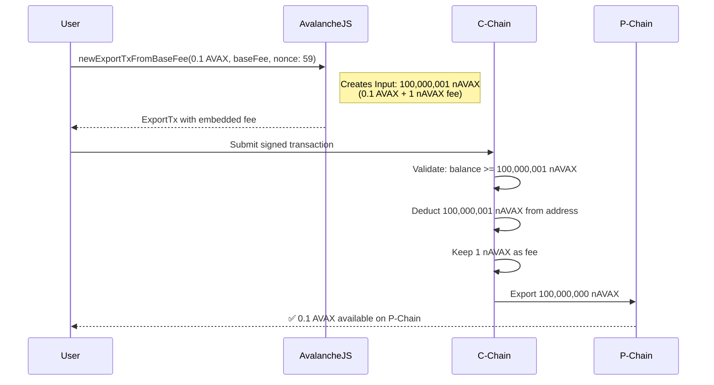

# Real-World EVM C to P Export Transaction Analysis

## Transaction Details

```json
{
  vm: 'EVM',
  getBlockchainId: [
    Function
    :
    getBlockchainId
  ],
  _type: 'evm.ExportTx',
  networkId: 5,
  blockchainId: yH8D7ThNJkxmtkuv2jgBa4P1Rn3Qpr4pPr7QYNfcdoS6k6HWp,
  destinationChain: 11111111111111111111111111111111LpoYY,
  ins: [
    Input
    {
      _type: 'evm.Input',
      address: avax1rgrl9wgkvl7tccf24vs5mrmfykuv7vgta3g86l,
      amount: 100000001n,
      assetId: U8iRqJoiJm8xZHAacmvYyZVwqQx6uDNtQeP3CQ6fcgQk3JqnK,
      nonce: 59n
    }
  ],
  exportedOutputs: [
    TransferableOutput
    {
      _type: 'avax.TransferableOutput',
      assetId: U8iRqJoiJm8xZHAacmvYyZVwqQx6uDNtQeP3CQ6fcgQk3JqnK,
      output: [
        TransferOutput
      ]
    }
  ]
}
```

## Key Insight: Fee Embedded in Input

- **Input**: 100,000,001 nAVAX (export amount + fee)
- **Output**: ~100,000,000 nAVAX (net export amount)
- **Fee**: 1 nAVAX difference (paid to network)

## Transaction Flow



## Fee Architecture

Unlike P-Chain/X-Chain transactions with explicit fee fields, EVM exports embed fees within input amounts, matching
Ethereum's gas model where fees are deducted from the sender's balance.
