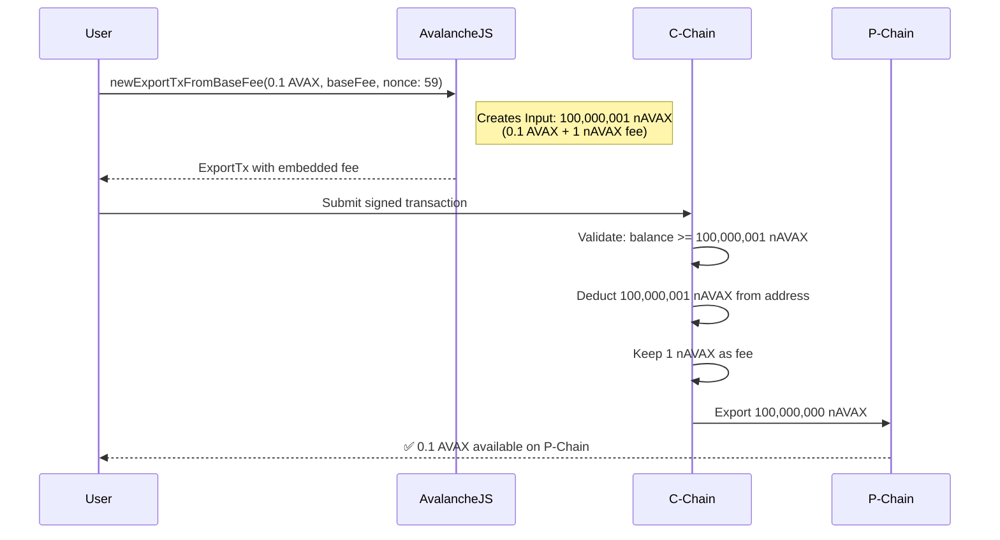
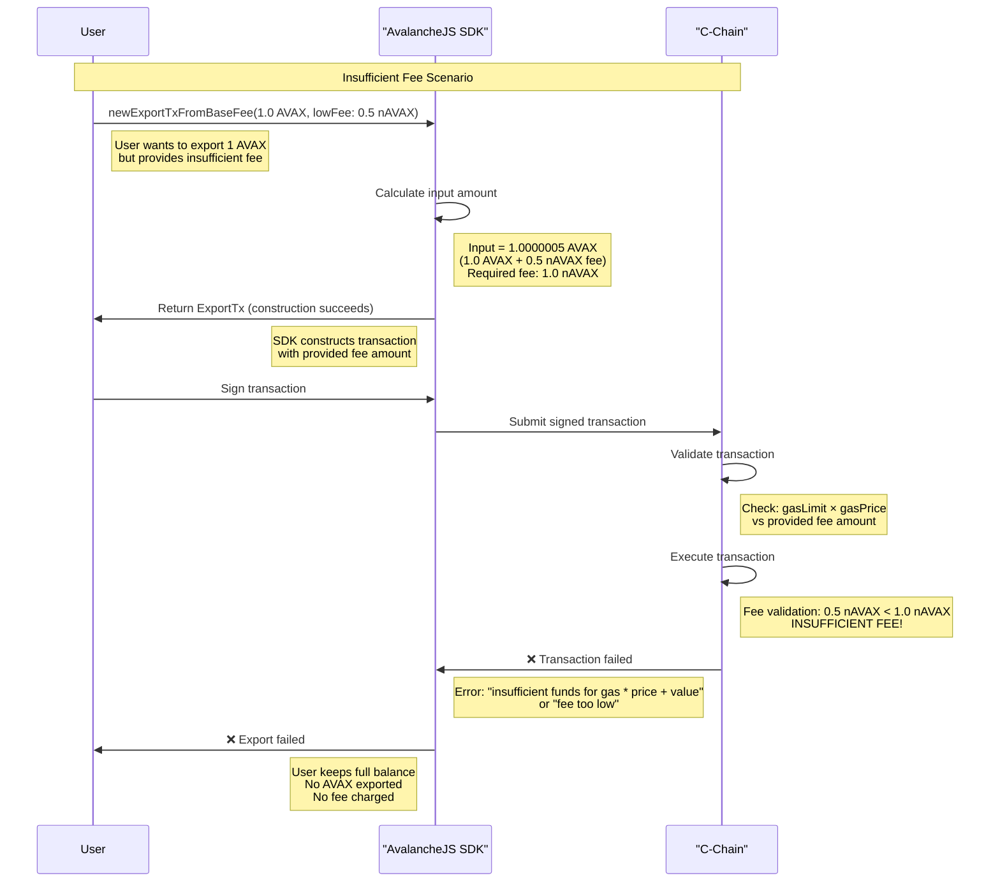
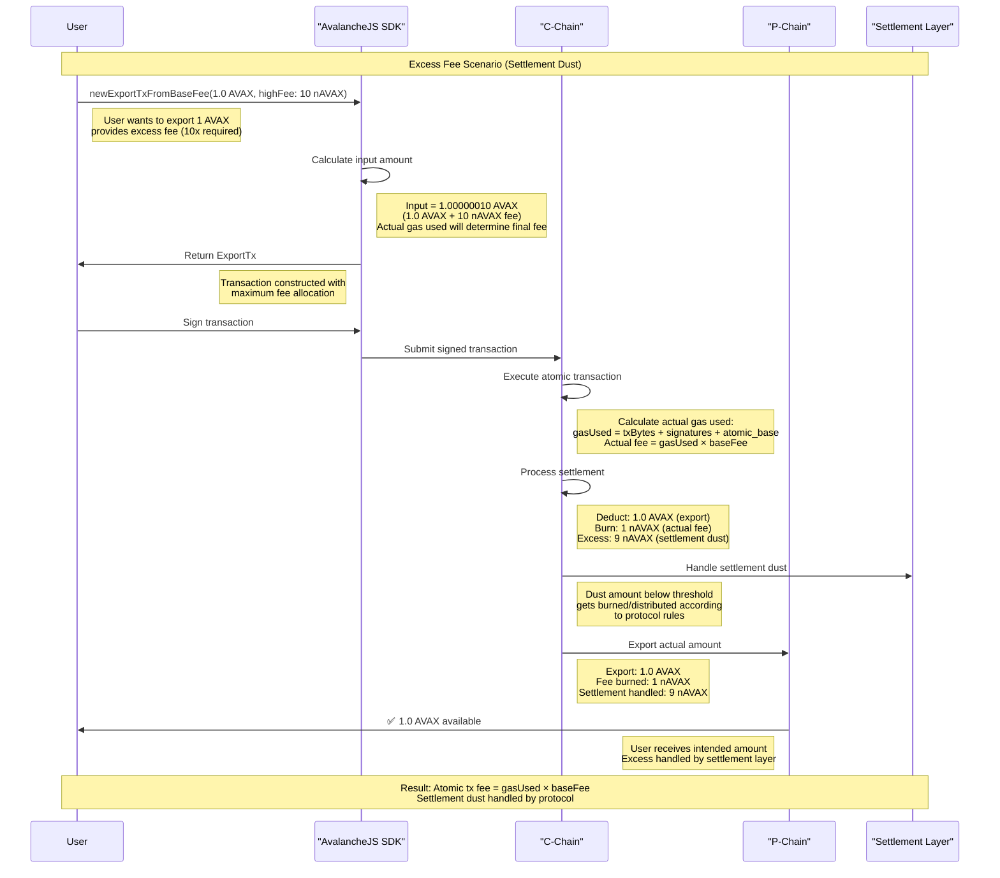
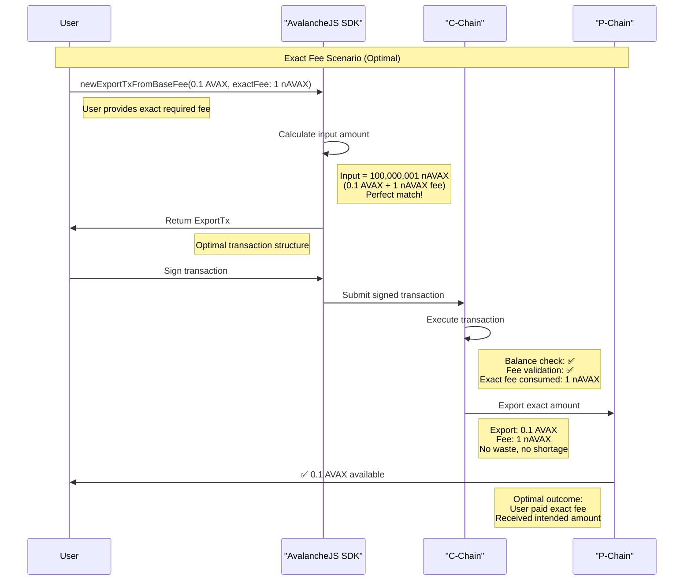

# Real-World EVM C to P Export Transaction Analysis

## Transaction Details

```json
{
  vm: 'EVM',
  getBlockchainId: [
    Function
    :
    getBlockchainId
  ],
  _type: 'evm.ExportTx',
  networkId: 5,
  blockchainId: yH8D7ThNJkxmtkuv2jgBa4P1Rn3Qpr4pPr7QYNfcdoS6k6HWp,
  destinationChain: 11111111111111111111111111111111LpoYY,
  ins: [
    Input
    {
      _type: 'evm.Input',
      address: avax1rgrl9wgkvl7tccf24vs5mrmfykuv7vgta3g86l,
      amount: 100000001n,
      assetId: U8iRqJoiJm8xZHAacmvYyZVwqQx6uDNtQeP3CQ6fcgQk3JqnK,
      nonce: 59n
    }
  ],
  exportedOutputs: [
    TransferableOutput
    {
      _type: 'avax.TransferableOutput',
      assetId: U8iRqJoiJm8xZHAacmvYyZVwqQx6uDNtQeP3CQ6fcgQk3JqnK,
      output: [
        TransferOutput
      ]
    }
  ]
}
```

## Key Insight: Fee Embedded in Input

- **Input**: 100,000,001 nAVAX (export amount + fee)
- **Output**: ~100,000,000 nAVAX (net export amount)
- **Fee**: 1 nAVAX difference (paid to network)

## Transaction Flow



## Fee Architecture

Unlike P-Chain/X-Chain transactions with explicit fee fields, EVM exports embed fees within input amounts, matching
Ethereum's gas model where fees are deducted from the sender's balance.

## Fee Scenarios Analysis

### Scenario 1: Insufficient Fee (Transaction Failure)

When a user doesn't provide enough fee for the export transaction:



### Scenario 2: Excess Fee (Settlement Dust Handling)

When a user provides more fee than required, C-Chain handles settlement dust:



### Scenario 3: Exact Fee (Optimal)

When a user provides the exact required fee:



## Fee Behavior Analysis

### Key Insights - CORRECTED

1. **Settlement Dust Mechanism**: C-Chain atomic transactions follow a gas-based model where fees are calculated as `gasUsed × baseFee`. Excess amounts beyond actual gas consumed are handled by the settlement layer as "dust."

2. **Actual Gas Charging**: Unlike my initial analysis, C-Chain atomic transactions charge only for actual gas used, not the entire input amount. The fee formula is deterministic: `1 × txBytes + 1,000 × signatures + 10,000 (base atomic cost)`.

3. **Construction vs Execution**: The SDK constructs transactions with estimated fees, but actual execution determines final gas consumption and fee.

4. **Protocol-Level Dust Handling**: Small excess amounts (settlement dust) are handled by the protocol's settlement mechanisms, not permanently lost to users.

### Corrected C-Chain Atomic Transaction Fee Model

**Official Formula** (from Avalanche docs):

```
gasUsed = 1 × len(unsignedTxBytes) + 1,000 × numSignatures + 10,000
actualFee = gasUsed × baseFee (converted to 9 decimals)
```

This means:

- **Only actual gas consumed is charged as fee**
- **Excess input amounts become settlement dust**
- **No arbitrary fee loss** beyond actual transaction cost

### Comparison with UTXO-based Fee Models

| Aspect                  | EVM Export (C-Chain)      | UTXO Import (P-Chain)                 |
| ----------------------- | ------------------------- | ------------------------------------- |
| **Excess Fee Handling** | Settlement dust mechanism | Cannot occur (exact amounts required) |
| **Fee Calculation**     | gasUsed × baseFee         | Explicit deduction from UTXO          |
| **Fee Predictability**  | Deterministic gas formula | 100% deterministic                    |
| **Settlement**          | Protocol handles dust     | No dust (exact amounts)               |
| **Fee Visibility**      | Gas-based calculation     | Explicit in transaction structure     |

### Best Practices - Updated

1. **Understand Gas Formula**: Use the deterministic gas calculation for accurate fee estimation
2. **Settlement Awareness**: Know that small excess amounts are handled by settlement, not lost
3. **Fee Estimation**: Use `estimateExportCost()` function for precise gas estimation
4. **Input Construction**: Input amount represents maximum deduction, not exact fee
