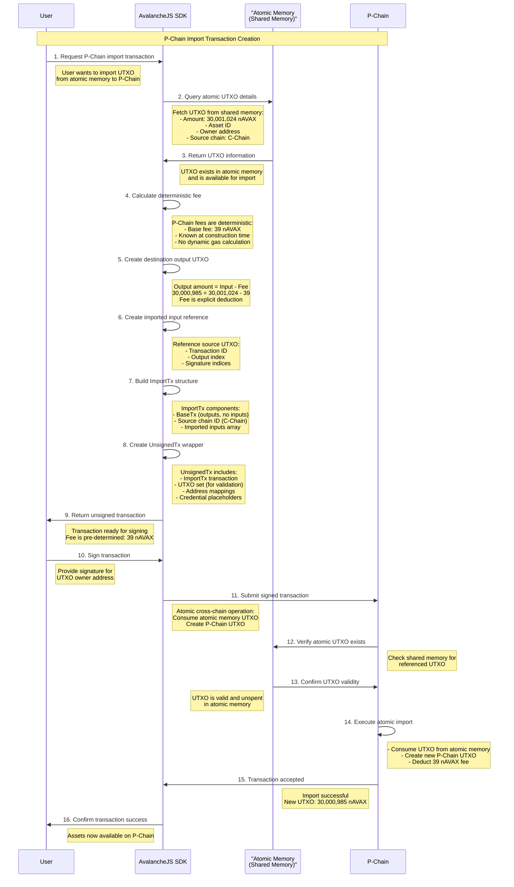

# P-Chain Import Transaction Analysis

## Overview

This document provides a comprehensive analysis of P-Chain import transactions in the Avalanche ecosystem, focusing on the UTXO-based transaction model, fee determinism, and cross-chain asset movement from C-Chain to P-Chain.

## Transaction Summary

**Real-World Example:**

- **Direction**: C-Chain → P-Chain
- **Transaction Type**: ImportTx (Type 17)
- **Network**: Fuji Testnet (ID: 5)
- **Input Amount**: 30,001,024 nAVAX
- **Output Amount**: 30,000,985 nAVAX
- **Fee**: 39 nAVAX (explicit deduction)
- **UTXO Reference**: `68858b2897caead7b79e24cba5df91cbca8271e4c1bb23736fe147a06e4dc844:0`

## P-Chain Import Transaction Flow

### Atomic Memory Layer

In Avalanche's cross-chain architecture, UTXOs don't move directly between chains. Instead, when assets are exported from one chain (e.g., C-Chain), they are placed in the **atomic memory** (also called shared memory) - a special layer that enables secure cross-chain communication. Import transactions then consume UTXOs from this atomic memory layer.



## Fee Determinism in P-Chain Transactions

### Key Question: Are P-Chain Fees Deterministic?

**Answer: YES** - P-Chain fees are completely deterministic and must be known at transaction construction time.

### Why P-Chain Fees Are Deterministic

1. **UTXO Output Creation**: When creating a P-Chain import transaction, you must specify the exact output amounts upfront
2. **Explicit Fee Deduction**: The fee is calculated as `inputAmount - outputAmount`
3. **No Dynamic Execution**: Unlike C-Chain gas fees that depend on execution complexity, P-Chain fees are fixed
4. **Pre-calculated Structure**: The entire transaction structure, including outputs, must be complete before signing

### Reasoning About Fee Determinism

The deterministic nature of P-Chain fees is a **fundamental architectural requirement** of the UTXO model:

**Mathematical Certainty:**

```
Fee = Sum(InputAmounts) - Sum(OutputAmounts)
```

Since you must specify all output amounts when constructing the transaction, the fee is mathematically determined at construction time. There's no execution step that could change this calculation.

**Structural Requirements:**

- **Output UTXOs must be created upfront**: Unlike account-based systems where balances are updated after execution, UTXO systems require creating the exact output UTXOs as part of the transaction
- **No conditional execution**: P-Chain transactions don't have complex execution logic that could affect gas consumption
- **Fixed transaction types**: Import transactions have a known, fixed fee structure

**Comparison with Dynamic Fee Models:**

- **C-Chain (EVM)**: `gasUsed × gasPrice` - depends on actual execution complexity
- **P-Chain (UTXO)**: Fixed base fee per transaction type - known before execution
- **Bitcoin**: Similar to P-Chain - fees based on transaction size/complexity, calculable upfront

**Practical Implications:**

1. **No Fee Estimation Needed**: Unlike EVM where you estimate gas, P-Chain fees are exact
2. **No Failed Transactions Due to Fees**: Cannot construct invalid transactions with insufficient fees
3. **Atomic Cross-Chain Operations**: Since fees are known, cross-chain operations are truly atomic
4. **Simplified UX**: Users see exact costs before signing, no "gas limit exceeded" errors

### Fee Calculation Example

```typescript
// P-Chain Import Fee Calculation
const inputAmount = 30_001_024n; // nAVAX from C-Chain UTXO
const baseFee = 39n; // Deterministic P-Chain fee
const outputAmount = inputAmount - baseFee; // 30,000,985 nAVAX

// Output UTXO must be created with exact amount
const destinationOutput = new TransferableOutput(
  assetId,
  new TransferOutput(
    new BigIntPr(outputAmount), // Exact amount known upfront
    outputOwners,
  ),
);
```

### Comparison: P-Chain vs C-Chain Fee Models

| Aspect              | P-Chain (UTXO)                     | C-Chain (Account)                                  |
| ------------------- | ---------------------------------- | -------------------------------------------------- |
| **Fee Timing**      | Pre-determined at construction     | Calculated during execution                        |
| **Fee Type**        | Fixed base fee                     | Dynamic gas fee                                    |
| **Output Creation** | Exact amounts required upfront     | Account balances updated post-execution            |
| **Predictability**  | 100% deterministic                 | Variable based on network congestion               |
| **Construction**    | Must know fee to build transaction | Can estimate, final amount determined at execution |

## Transaction Structure Analysis

### Raw Transaction Breakdown

```
Hex: 0000000000110000000500000000000000000000000000000000...

Header:
- Codec ID: 0
- Transaction Type: 17 (ImportTx)
- Network ID: 5 (Fuji)

Base Transaction:
- Blockchain ID: P-Chain
- Outputs: 1 (destination UTXO)
  - Asset ID: AVAX
  - Amount: 30,000,985 nAVAX
  - Address: 9435373e894a43c335ed84d72e8212681db46dc7
- Inputs: 0 (no base inputs)

Import Fields:
- Source Chain: C-Chain (7fc93d85...c10d5)
- Imported Inputs: 1
  - UTXO ID: 68858b28...dc844:0
  - Asset ID: AVAX
  - Amount: 30,001,024 nAVAX
  - Signature Indices: [0]
```

### Complete Signed Transaction JSON

```json
{
  "codecId": "0",
  "vm": "PVM",
  "txBytes": "0x000000000011000000050000000000000000...",
  "utxos": [
    "0x68858b2897caead7b79e24cba5df91cbca8271e4c1bb23736fe147a06e4dc844..."
  ],
  "addressMaps": [[["0x9435373e894a43c335ed84d72e8212681db46dc7", 0]]],
  "credentials": [
    ["0x000102030405060708090a0b0c0d0e0f101112131415161718191a1b1c1e1d1f..."]
  ]
}
```

## SDK Construction Guide

### Step-by-Step Transaction Creation

```typescript
import { ImportTx, BaseTx } from '@avalabs/avalanchejs';

// Step 1: Get UTXO from atomic memory (exported from C-Chain)
const sourceUtxo = {
  txId: '68858b2897caead7b79e24cba5df91cbca8271e4c1bb23736fe147a06e4dc844',
  outputIndex: 0,
  amount: 30_001_024n, // nAVAX
  assetId: '3d9bdac0ed1d761330cf680efdeb1a42159eb387d6d2950c96f7d28f61bbe2aa',
  address: '9435373e894a43c335ed84d72e8212681db46dc7',
};

// Step 2: Calculate deterministic fee (known upfront)
const fee = 39n; // nAVAX - deterministic P-Chain fee
const outputAmount = sourceUtxo.amount - fee;

// Step 3: Create imported input reference
const importedInput = new TransferableInput(
  new UTXOId(Id.fromString(sourceUtxo.txId), new Int(sourceUtxo.outputIndex)),
  Id.fromString(sourceUtxo.assetId),
  new TransferInput(
    new BigIntPr(sourceUtxo.amount),
    new Input([new Int(0)]), // Signature index
  ),
);

// Step 4: Create destination output (fee already deducted)
const destinationOutput = new TransferableOutput(
  Id.fromString(sourceUtxo.assetId),
  new TransferOutput(
    new BigIntPr(outputAmount), // Exact amount known upfront
    new OutputOwners(
      new BigIntPr(0n), // No locktime
      new Int(1), // Threshold
      [Address.fromString(sourceUtxo.address)],
    ),
  ),
);

// Step 5: Create ImportTx
const importTx = new ImportTx(
  new BaseTx(
    new Int(5), // Fuji network ID
    Id.fromString('P_CHAIN_ID'),
    [destinationOutput], // Pre-calculated outputs
    [], // No base inputs
  ),
  Id.fromString('C_CHAIN_ID'), // Source chain
  [importedInput], // Imported inputs
);

// Step 6: Create UnsignedTx wrapper
const unsignedTx = new UnsignedTx(
  importTx,
  [sourceUtxo], // UTXOs for validation
  addressMaps, // Address to index mapping
  [], // Credentials (filled after signing)
);
```

## Key Architectural Differences

### P-Chain (UTXO Model) Characteristics

1. **Deterministic Fees**: Fees must be known at construction time
2. **Explicit UTXO Management**: Each transaction explicitly consumes and creates UTXOs
3. **State-Dependent Construction**: Requires knowledge of existing UTXOs
4. **Atomic Operations**: Cross-chain imports are atomic (all-or-nothing)
5. **Pre-calculated Outputs**: All output amounts must be specified upfront

### C-Chain (Account Model) Characteristics

1. **Dynamic Fees**: Gas fees calculated during execution
2. **Account Balance Updates**: Balances modified rather than UTXO creation
3. **Optimistic Construction**: Can build transactions without full chain state
4. **Gas-based Pricing**: Fees depend on computational complexity
5. **Post-execution Amounts**: Final amounts determined after execution

## Fee Determinism Benefits

1. **Predictable Costs**: Users know exact fees before submitting transactions
2. **No Failed Transactions**: Cannot submit invalid transactions due to insufficient fees
3. **Simplified Planning**: Applications can calculate exact costs upfront
4. **Atomic Guarantees**: Cross-chain operations succeed or fail atomically

## Verification Steps

To verify a P-Chain import transaction:

1. **Atomic UTXO Existence**: Confirm UTXO exists in atomic memory (from C-Chain export)
2. **UTXO Ownership**: Verify UTXO is owned by the signing address
3. **Asset ID Validation**: Ensure asset IDs match between input and output
4. **Fee Calculation**: Verify `inputAmount - outputAmount = expectedFee`
5. **Signature Validation**: Confirm signature matches UTXO owner
6. **Atomic Memory Verification**: Validate source chain ID and atomic UTXO reference

## Conclusion

P-Chain import transactions demonstrate Avalanche's sophisticated cross-chain architecture with deterministic fee structures. Unlike account-based models where fees are calculated dynamically, P-Chain's UTXO model requires complete fee knowledge at construction time, enabling predictable costs and atomic cross-chain operations.

The deterministic nature of P-Chain fees is a direct consequence of the UTXO model requiring explicit output creation upfront, providing users with certainty about transaction costs before execution.
